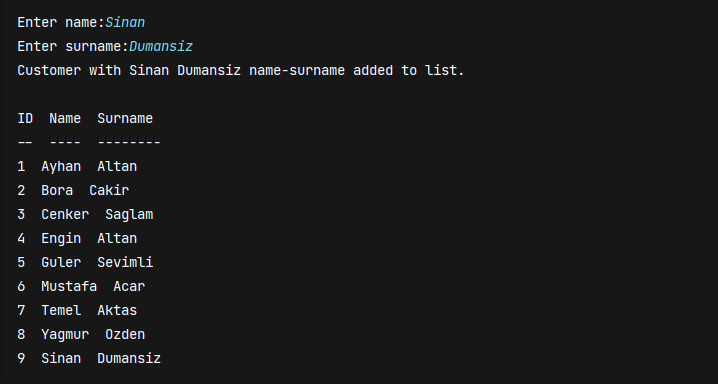

# e-commerce-system
### A basic e-commerce console application with using liked-lists in C language.

## -Example Runs-

### Menu

### Adding New Customer

### Delete Customer

### Add Basket

### Printing the user who purchased the same product

